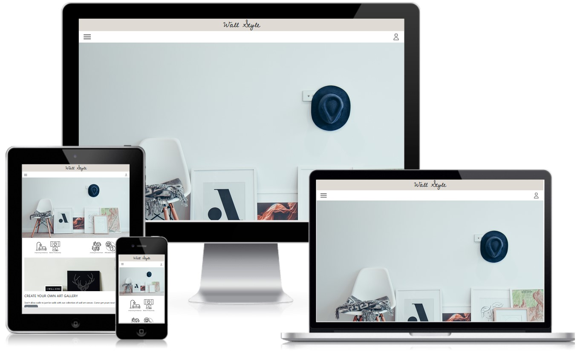
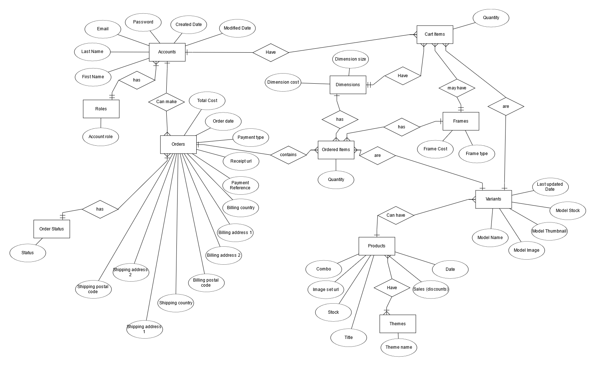
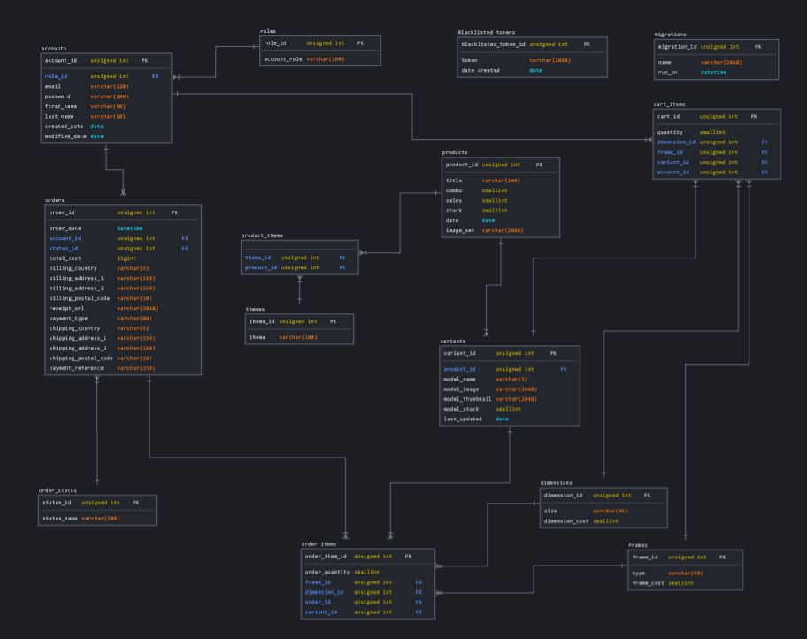
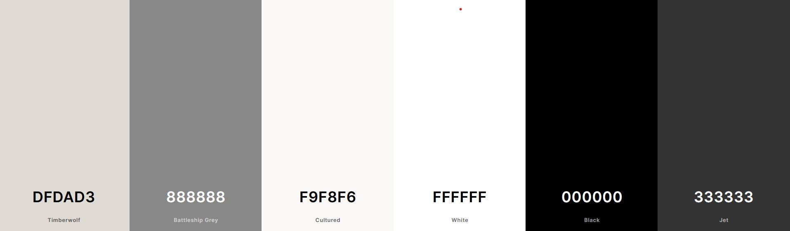

# Wall Style

Access live demo site [here](https://wall-style.netlify.app/)



Test Accounts:
1. Admin Panel at https://wall-style.herokuapp.com/accounts/login
 - Owner account (Able to access everything)
    - email: owner@hotmail.com
    - password: password123

 - Admin account (Able to see look at products and variants page, unable to do CRUD)
    - email: admin@hotmail.com
    - password: password123

2. Customer at https://wall-style.netlify.app/login
 - email: customer@test.com
 - password: password123

## Background

For most of us, our homes serves as a sanctuary that we can retreat to after a day of work and activities. Therefore, many people will spend time and money to decorate their homes in a way that is pleasing to their eyes and help them to switch to a more relaxed mode. Interior design comes into play and an inexpensive and efficient method to quickly brighten up dull walls are hanging art canvases as opposed to having to mix and match colours to repaint walls

## Project Overview

This E-commerce project will aim to supply home-owners that wants to change the general outlook of the walls in their houses with the right art. These art will be in the form of a canvas where home-owners can choose which frames and dimensions their wall art comes in. It will allow them to take ownership of their walls design rather than depend excessively on interior designers

---

## The Five Planes of UI/UX

### Strategy

#### Organization's Goals
To act as a bridge between homeowners and their preferred ideal designs for the walls back in their homes

#### Users' Goals
As there is a high home ownership in Singapore, combined with the spread of this new trend via social media,families may look for creative ways to spruce up their home walls using their preferred pieces of art. 

1. **Organisation**
   - Objective: To have an eCommerce ready for interested home owners looking for art canvases to decorate their walls

2. **Users: Homeowners**
   - Objective: To look for their preferred art canvases to spruce up their house walls
   - Needs:
      - Able to search for art that are related to a theme
      - Able to search for art that are able to be complemented with other art to form a set
   - Demographics and Characteristics:
       - New homeowners
       - Homeowners that wants to design their own walls instead of depending on an interior designer
   - Pain point:
       - Not a lot of eCommerce to choose from for art pieces


User Stories | Acceptance Criteria(s)
------------ | -------------
As a homeowner, I would like to buy art pieces of a certain theme that I can use to decorate walls | Art canvases need to be labelled as under one or more themes
As a homeowner, I would like to be able to buy a set of a matching art canvases | Art that is able to come in a set should be labelled to show if it is part of a set and each model in the set be shown individually before putting them together to see how a set will look like.
As a homeowner, I would like to be able to save as much as I can on interior design after spending a ton of money on renovations or getting the house itself | Art canvases will also be categorised between those that have discounts and those that do not have any discount


### Scope

### Database


ERD is drawn up to demonstrate the different relationship between enitities for the site before proceeding to model the database (SQL).



Logical Schema is drawn up based on the ERD diagram to show the relationship between tables and also the number of columns with its type defined.

A backend server will thus be necessary in order to allow communication between the site and database. Therefore,an Express server have been set up and deployed to [Heroku](https://www.heroku.com/). API endpoints are accessible via the base at https://wall-style.herokuapp.com/api.

#### Content
As this is an eCommerce platform, shop owner will have to provide the content and products. Products, customers and orders will need to be managed. Express servers also serves as an admin panel for management of data, and it will be accessed after registering at https://wall-style.herokuapp.com/accounts/signup. Only the owner can register an account for admin users.

#### eCommerce
- Search function against attributes such as Title, Themes, having discounts and if it is part of a set themes
- Register as a customer
- Login and cart management as a customer
- Payment processing and ordering as a customer

#### Admin 
- Search function against attributes such as Title, Themes, having discounts, whether item is part of a set, minimum and maximum discount and date which product was added
- Read products and their variants for stock checking purposes

#### Owner
- Register an employee as admin
- Create, update, delete and read all available products and variants
- Able to view orders and update its status

#### Non-functional
- Mobile responsiveness: forms and search results display should not obstruct users' experience in the site
- Accessibility: colors used are safe for colorblind, interactive elements have aria-labels for assistive technology 
- Performance: database may get larger and slower to load overtime, a loading screen is included on eCommerce to help bridge the gap between site and data loading

#### Branding

Brand name is combining the words wall and style. This allows potential customers to make an easy guess about what the E-commerce is selling without having to delve too deep into the website. Wall interior design can be thought of as styling a wall just like how a stylist would style a human.

Cedarville Cursive font has been chosen for the branding as it is in a handwriting style that helps to bring out the artistic feel of the website. This adds to the setting of an art exhibition where customers will be able to feel like they are looking at art pieces in a gallery exhibition instead of shopping.

#### Color Scheme



- #DFDAD3 (Timberwolf) color, #F9F8F6 (Cultured) and white have been chosen as the primary and secondary colors because it provides a minimalistic and decluttered outlook for the website. This colour theme also coincide with that found in art galleries. It allows the art work to be a focal point when contrasted with a white background.


## Testing
Test Cases will be updated soon

---


## Limitations and Future Implementations

| Limitations | Future Implementations |
| -------- | ----------- |
| There are some bugs for the cart where any action made by users in the cart result in a page refresh and forms have no validation yet | Work on fixing the cart bugs issue and add validation for the forms |
| All products are currently loaded in the React frontend from the start, which can affect the performance of the web application | Implement pagination feature in the API route for retrieving products | 

## Dependencies and Sources

### Backend
1. [Express](https://expressjs.com/) as the framework for routing to project's endpoints
2. [db-migrate](https://db-migrate.readthedocs.io/en/latest/) as the database migration framework
3. [Axios](https://axios-http.com/) as HTTP client to external endpoints
4. [Bookshelf.js](https://bookshelfjs.org/api.html) for accessing database on SQL databases 
5. [caolan forms](https://github.com/caolan/forms) to help create and validate forms in the backend and admin panel
7. [cors](https://www.npmjs.com/package/cors) as middleware to enable CORS
8. [dotenv](https://www.npmjs.com/package/dotenv) to separate code from envrionment variables
9. [express-session](https://www.npmjs.com/package/express-session) as the session management middleware
10. [express-flash](https://github.com/RGBboy/express-flash) as flash messages middleware
11. [jsonwebtoken](https://github.com/auth0/node-jsonwebtoken) as the authentication framework with Frontend
12. [handlebars](https://handlebarsjs.com/) as the templating language to generate HTML for admin panel
15. [Cloudinary](https://cloudinary.com/documentation) as the digital assets mangement for products' images

### Frontend
1. [React](https://reactjs.org/) as the frontend framework
2. [React Router DOM](https://reactrouter.com/docs/en/v6/getting-started/overview) for routing paths in React app
3. [Axios](https://axios-http.com/) as HTTP client to Express server endpoints
5. [React Bootstrap](https://react-bootstrap.github.io/) is used for carousel component, offcanvas, forms and button
6. [stripe](https://stripe.com/en-gb-sg) as payment gateway
7. [react-icons](https://react-icons.github.io/react-icons/) as icons used for the site
8. [SpinKit](https://tobiasahlin.com/spinkit/) CSS spinner is adapted from this site
9. [Google Fonts](https://fonts.google.com/) Fonts are taken from this site

### Platforms and Software
1. [Git](https://git-scm.com/) for version control
2. [GitHub](http://github.com) for the repository
3. [Gitpod](https://gitpod.io/workspaces) for code editing
4. [Heroku](https://www.heroku.com/) for deployment of Express server
5. [Netlify](https://www.netlify.com/) for deployment of React app


### Images and Logos
1. Product images is obtained from [Canva Home](https://canvahome.com/)
2. Images used in home page is obtained from [Unsplash] (https://unsplash.com) 
3. The four logos used on the home page on reasons why to buy wall art is obtained from [Canva Home](https://canvahome.com/)

### Other Attributions
1. [Paul Chor](https://github.com/kunxin-chor) for all his guidance and using his tutorials as references for the codes 
2. [Coolors](https://coolors.co/) for matching the colours selected
3. [Canva Home](https://canvahome.com/) for inspiring the overall design 

---

## Deployment

### Frontend

The website is hosted using [Netlify](https://www.netlify.com/), deployed directly from the main branch of this Github repository.
For the detailed deployment steps, you can refer to the blog post on Netlify [here](https://www.netlify.com/blog/2016/09/29/a-step-by-step-guide-deploying-on-netlify/).

### Frontend Deployment
[](https://app.netlify.com/sites/wall-style/deploys)

### Database migrations
The database and data can be migrated to any SQL running the following command at the root of the Express project folder:
```
node database/db-migrate-up.js
```

The command will recreate tables and sample data except on any user dependant information such as system accounts, customer accounts, cart items, orders, payments and products.

### Backend

The Express server is hosted using [Heroku](https://www.heroku.com/), deployed directly from the main branch of the Github repository [here](https://github.com/JunHao-k/wallstyle_fe).
For the detailed deployment steps, you can refer to the documentation on Heroku [here](https://devcenter.heroku.com/articles/git#deploy-your-code).


The Express server makes use of the following environment variables:

```
SESSION_SECRET=

DB_DRIVER=
DB_USER=
DB_PASSWORD=
DB_DATABASE=
DB_HOST=

CLOUDINARY_NAME=
CLOUDINARY_API_KEY=
CLOUDINARY_API_SECRET=
CLOUDINARY_UPLOAD_PRESET=

TOKEN_SECRET=
REFRESH_TOKEN_SECRET=

STRIPE_PUBLISHABLE_KEY=
STRIPE_SECRET_KEY=

STRIPE_SUCCESS_URL=
STRIPE_CANCEL_URL=
STRIPE_ENDPOINT_SECRET=
```

---

